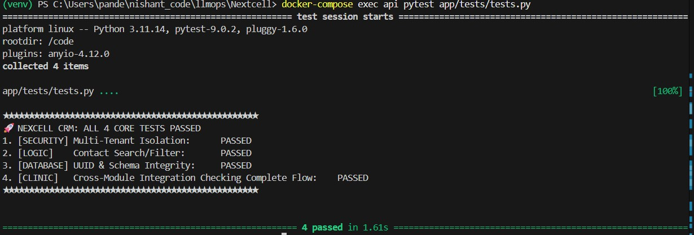

***** STEPS TO RUN THE PROJECT

    1 Environment Configuration
        The project uses environment variables for database connectivity and security.

        Create a file named .env in the root directory.

        Copy and paste the following configuration:

            DATABASE_URL=postgresql://user:password@db:5432/crm_db
            SECRET_KEY=7ca71050a9961726a84f33b9347895e3475f462a67e58838
            ALGORITHM=HS256

    2. Deploy with Docker
        Build the images and start the services (API and Database) using Docker Compose. 
        docker-compose up -d --build
    3. Run the Test Suite (Main Flow & Security)
        docker-compose exec api pytest app/tests/tests.py -v

***** CRM STRUCTURE AND ORGANIZATION

       I have built as a production-grade CRM designed to serve clinics through a Shared Core + Industry Modules approach.

        1. Core Entities (core_models.py) 

        + Contacts: The primary identity layer for individuals such as Customers, Leads, or Patients.
        + Deals: Manages the sales pipeline with stages like "Qualification" or "Closed".
        + Activities: A unified log for interaction history, including tasks, notes, and events.
        Note: Deals and Activities are linked to a specific Contact via contact_id to ensure a 360-degree view of the customer.

        2. Clinic Industry Module (clinic_models.py) 

       This Implemention extends the core specifically for the medical sector:
       + Appointments: A specialized entity tracking practitioner_name, appointment_time, and status.

        Note: Appointment class uses patient_id as a foreign key to the Core Contact entity
 

***** ORAGANIZATION OF THE SYSTEM

    + Multi-tenant model: My CRM uses a single-platform, many-client model where every record is logically separated.

    + Data separation and security: Strict isolation is enforced by a mandatory tenant_id on every table (Contacts, Deals, Activities, and Appointments). This ensures that database queries are hard-scoped so one client can never see another's data.

    + RBAC (roles/permissions): The architecture is designed to support Role-Based Access Control. Roles like "Admin" or "Practitioner" will define specific access levels within a tenant's data.

    + Audit logs: The system structure allows for a centralized logging strategy to track record changes, ensuring accountability for sensitive clinical and sales data. It can be implemented in the future.

***** Platforms & Systems 

    + Backend: FastAPI (Python) for asynchronous performance and native Swagger/OpenAPI documentation.

    + Database: PostgreSQL for relational integrity and native UUID support.

    + Auth: I chose stateless JWT because it allows the tenant_id to be securely encoded and cryptographically signed within the token payload, enabling high-performance, database-free authentication that ensures strict multi-tenant isolation.
    + Frontend: In the future I would Next.js on Vercel to utilize server-side rendering (SSR) and global edge caching for a fast CRM interface.

    + CI/CD Pipeline: In the future GitHub Actions combined with Docker Hub will be usedto automate container builds and run unit tests on every code push.

    + Cloud Hosting: AWS ECS (Elastic Container Service) would be usedwith Fargate for serverless container management that scales automatically based on tenant traffic.

    + Integrations in the future:

        Email/SMS: Twilio or SendGrid.

        Calendar: Cronofy or Google Calendar API for Appointment sync.

        File Storage: AWS S3 for clinical attachments/notes.

***** Cost Model & Efficiency 

       + Estimated Monthly Infra (MVP): £30–£50.
       + Calculated using AWS App Runner (~£15) and RDS t4g.micro (~£25).

***** Cost Reduction :

        + Reuse: Shared Core reduces duplicate code for different industry modules.

        + Open-Source: Leveraging FastAPI and SQLAlchemy avoids licensing fees.

        + Modularity: Industry-specific logic is isolated, making the system cheaper to maintain and extend.

***** 4-Week Execution Plan

Week 1: Establish the multi-tenant foundation, JWT authentication, and Dockerized PostgreSQL environment.

Week 2: Develop tenant-scoped CRUD endpoints for Core CRM entities including Contacts, Deals, and Activities.

Week 3: Implement the Clinical vertical module including Patient extensions, Appointments, and relational logic.

Week 4: Conduct QA testing for tenant isolation, perform security hardening, and finalize production deployment.

***** Coding Backbone Spec

    📂 Folder Structure (Domain Separation)
        The project follows a modular, domain-driven design to ensure the core CRM can be easily extended with new industry verticals:
        + /app/api: Contains the route handlers for both core (Contacts, Deals) and vertical (Clinics) modules.
        + /app/core: Central logic for security, JWT handling, and tenant identification.
        + /app/models: Database schemas divided into core_models (shared) and clinic_models (industry-specific).
        + /app/db: Database connection logic and session management.
         +/app/tests: Automated suite to verify tenant isolation and the main clinical flow.

    🔐 Multi-Tenant Security & RBAC

        + Data Isolation: Every database table includes a tenant_id column. All queries are strictly scoped using a FastAPI dependency that extracts the tenant_id from the JWT.
        + Authentication: Uses a JWT-based system where the tenant_id is embedded in the token payload.
        + RBAC Strategy: While the MVP uses simple authentication, the architecture is designed to support roles (e.g., Admin, Practitioner, Agent) by adding a role field to the User model and checking permissions in the route dependencies.

    ⚙️ Environment & Schema Management

        + Environment Config: Managed via a .env file to handle sensitive credentials like DATABASE_URL and SECRET_KEY.
        + Schema Setup: Uses SQLAlchemy’s Base.metadata.create_all for a reproducible database setup on startup, ensuring the environment is ready immediately after docker-compose up
        +API Documentation: Leverages FastAPI’s native integration with Swagger UI, available at /docs, for interactive testing and exploration of the "Main Backbone" endpoints.

    🛠️ Tech Stack Justification

        + Backend: FastAPI (Python) for high performance, asynchronous support, and native OpenAPI documentation.

        + Database: PostgreSQL for robust relational data handling and native UUID support, which is critical for distributed multi-tenant systems.

        + Containerization: Docker Compose to ensure a "one-command" setup that bundles the API and the database for the assessor.

***** REPO STRUCTURE 

        /crm-backbone
        ├── /app
        │   ├── main.py           # Application entry point and router registration 
        │   ├── /api              # Route handlers (Contacts, Appointments, etc.) 
        │   ├── /core             # Security, JWT logic, and Tenant Middleware 
        │   ├── /models           # SQLAlchemy ORM models (Core & Clinic) 
        │   ├── /db               # Database connection and session management 
        │   └── /tests            # Pytest suite for isolation and main flow 
        ├── docker-compose.yml    # Multi-container orchestration (API + DB) 
        ├── Dockerfile            # Container build instructions for the Python API
        ├── schemas.sql           # SQL representation of the database schema 
        ├── requirements.txt      # Python dependencies 
        └── README.md             # Product, Architecture, and Cost Plan 

***** TEST RESULT

